---

> **Bu proje 2017 Eylül ayında lisans ödevi olarak geliştirildi. Makineyi kurcalarken karşılaştım, silmek yerine öğrenci arkadaşlara fikir verebilir diye paylaşmak istedim.**

---

# İçindekiler
1. [Attackted](#attackdet)
2. [Giriş](#giriş)
3. [Proje Geliştirilirken Karşılaşılan Problemler](#proje-geliştirilirken-karşılaşılan-problemler)
4. [HTTP Protokolü](#http-protokolü)
5. [Senkron ve Asenkron Programlama](#senkron-ve-asenkron-programlama)
6. [Makine Öğrenmesi](#makine-öğrenmesi)
7. [Web Uygulamasına Ait Ekran Görüntüleri](#web-uygulamasına-ait-ekran-görüntüleri)
8. [Projeyi Çalıştırma](#projenin-çalıştırılması)
9. [Referanslar](#referanslar)

# Attackdet
Real-Time Analysis Of Http Trafic With Machine Learning

## Giriş

Geliştirilen proje, uygulama katmanı seviyesinde bir sunucuya gelen http trafiğini yakalayarak real-time bir şekilde göstermektedir. Yakalanan http trafiğine ait paketler makine öğrenmesi ile eğitilmiş bir modele verilerek bir tahminde bulunmaktadır. Diğer bir ifadeyle gelen trafikteki şüpheli aktiviteleri sınıflandırmak için gelen paketler eğitilen makine öğrenmesi modeline verildikten sonra dönen yanıtı real-time olarak bir web uygulamasında göstermektedir. Bu sayede şüpheli aktivitelerin veya zararlı girişimlerin tespiti daha kolay bir şekilde yapılabilmektedir.

Real-time çalışan uygulamalarda stabilite ve performans en önemli unsurlardandır. Projede özellikle bütün http trafiğinin sniff edilerek makine öğrenmesine verildikten sonra çıkan sonuç grafiklerde eş zamanlı gösterilmektedir. Veri transferini anlık ve hızlı bir şekilde gerçekleştirmek için websocket teknolojisinden faydalanılmıştır. Yoğun http trafiğinin olacağı durumlarda senkron çalışan bir yapıda işlemler bloklanacağından dolayı gecikmeye ve uygulamanın sağlıklı çalışmamasına sebebiyet verecektir. Bu nedenle, asenkron çalışan kütüphaneler kullanılmıştır.

Projenin en önemli bileşenlerinden biri ise, gerçek zamanlı olarak yakalağı HTTP paketlerini makine öğrenmesi sayesinde ilgili paketin yararlı veya zararlı/şüpheli olduğuna dair bir sonuç döndermesidir. Ayrıca bu sonuca ait grafiğin de real-time olarak gösterilmektedir. Bu sayede binlerce log dosyaları arasında koybolmaya gerek kalmadan bütün veriler grafiklerle desteklenmiştir. Diğer yandan makine öğrenmesiyle bir sonuca ulaşıldığından dolayı analizlerde ayrıca bir kolaylık sağlamaktadır.

**Attackdet** uygulaması 3 temel parçadan oluşmaktadır. Bu parçalardan ilki network trafiğini arkada sniffleyerek parse etmektedir. İkinci kısım ise parse edilen verinin makine öğrenmesine verilmesidir. Son kısım ise parse edilen network paketlerine ait verilerin ve makine öğrenmesinden çıkan sonucun real-time bir şekilde web uygulamasında göstermektedir.

Back-end tarafında **python** programlama dili kullanılmıştır. Python diliyle geliştirilen Tornado kütüphanesi kullanılmıştır. Bu kütüphane asenkron çalıştığından dolayı işlemler bloklanmadan gerçekleştirilebilmektedir.

Diğer bir önemli kütüphane ise **scapy**. Networkdeki bütün layerlarda istenilen paketleri oluşturma, değiştirme, yakalama kısaca bütün network tabanlı işlemleri yapmamızı sağlayan çok güçlü bir kütüphane. Bu kütüphane sayesinde sunucuya gelen ve giden bütün trafik sniff edilerek parse işlemine tabi tutulmuştur. Parse işleminden sonra elde edilen veriler websocketler yardımıyla web uygulamasına gönderilmektedir.

Makine öğrenmesi tarafında ise **sklearn** kütüphanesi kullanılmıştır. Bu kütüphanede bulunan Tf-idf sınıfı sayesinde text ifadeler tf-idf modeline uygun şekilde sayısallaştırılmıştır. Böylece makine öğrenmesinin uygun bir model çıkarabilmesi için gerekli işlemleri yapabilecek bir matris formuna dönüştürülmüştür. Dataset üzerinde daha kolay işlemler yapabilmek için pandas kütüphanesinden faydalanılmıtır. Son olarak modelin bir kez eğitilmesinden sonra tekrar tekrar eğitilmemesi için **pickle** kütüphanesi kullanılarak model kaydedilip kaydedilen model üzerinden işlemler gerçekleştirilmiştir. 

Projenin web uygulama tarafında ise **javascript** kullanılmıştır. Python tarafında tornado kütüphanesi sayesinde websocket üzerinden gönderilen veriler javascript ile alınmıştır. Javascript kütüphanelerinden olan **chart.js** sayesinde gelen verileri görselleştirmek için gerekli grafikler oluşturulmuştur. Gelen veriler stream veri olduğu için ayrıca chart.js kütüphanesi için streaming plugini kullanılmıştır. Böylece streming veri transferi real-time bir şekilde grafikleştirillmiştir.

## Proje Geliştirilirken Karşılaşılan Problemler

Proje geliştirilirken karşılaşılan bir kaç ana problem bulunmaktaydı.
Ağı sniffleyip yakalanan paketleri parse ettikten sonra aynı zamanda bu verileri anlık olarak web uygulamasına gönderip grafikler ile göstermek. Çünkü ağ snifflendiği zaman başka işlemin yapılamıyor olması gerekir. Bu problemin çözümü aslında multi processing veya multi threading ile çözülebilir gibi görünse de hesapta olmayan bir süreç gerçekleşti. Threadler aynı process uzayında çalıştığından dolayı ve sniff edilen paketlerin sayısı artığı zamanlarda aynı bellek alanında bir çok işlem gerçekleşeceği için deadlock ve race condition gibi problemlerin çıkma ihtimali oldukça yüksekti. Multi processing kullanmamamızın nedeni ise işimizi daha karmaşıklaştırıp performans açısından oldukça sorunlar çıkartacağı içindi. İki process ile işlem yapmak başta çok mantıklı ve performanslı gibi gelsede tek bir işlem yapılacağı zaman bu prosesler arasında senkronizasyon yapılamayacağından bu durum probleme tam olarak çözüm sunamadı. 
 
İkinci ana problem ise network snifflendiği esnada yakalanan paketler web uygulamasına gönderilirken web uygulamasının veriyi işlemesini beklemek zorunda olmak. Yani gelen bir network paketini işleyip sonuç dönmeden 2. Paketi işleme al(a)maması. Bu tür işlemler senkron çalışmaktadır. Senkron çalışan işlemlerde gönderilen request’e response dönmeyene kadar ikinci request’in gönderilemiyor olmasıdır. Aslında asenkron programlama kullanarak ikinci ana problemde çözülmüş oldu.

En önemli bileşen olan makine öğrenmesinde karşılaştığımız problem ise saniyede yapılacak onlarca verinin makine öğrenmesi modeline verildikten sonra en kısa zamanda sonuç dönderebilmeliydir. Çünkü proje real-time çalışacağından dolayı herhangi bir gecikmenin olmaması gerekirdi. Ayrıca real-time olarak web uygulamasındaki grafiklerde gösterilmesi gerekmekteydi. Python yorumlanan bir dil olduğundan dolayı ve yorumlanan dillerin doğası gereği her çalıştırıldıklarında bütün kodu tekrar sıfırdan yorumlamasıdır. Bu durum real-time uygulamada modelin eğitirken sürenin oldukça uzamasına neden olmaktadır. Yani her uygulamayı çalıştırdığımız eğitim verileri ile sistem tekrar tekrar kendini eğitmekteydi. Bu problemi çözebilmek için; eğitim verimizi sisteme verip eğitikten sonra eğitim sonrası oluşan modeli serilize ederek binary formatta kaydetmek oldu. Böylece kaydedilen model üzerinden sistem tekrar çalışacağından bekleme süresini ortadan kaldırılmış oldu. 

## HTTP Protokolü

HTTP stateless çalışan protokolüdür. Yani server aynı kişi tarafından gönderilen iki isteğin aynı kişiden geldiğini aslında bilmiyor. (Burda işin içine cooki giriyor.)  HTTP 1.1’den önce her request servera yeni bir connection yaratılırdı. HTTP 1.1 ile birlikte birden çok request/response çifti için tek bir tcp connection’ı kullanılabilir hale geldi. Bu yeni yapı http-keep alive ya da http persistent connection olarak adlandırılır. Http half duplex, yani tek yönlü bir protokoldür.
En yalın ifadeyle HTTP protokolü server ve client mimarisiyle çalışmaktadır. Server, burda hizmeti sağlayan ve gelen taleplere yanıt dönmekle sorumlu olan yapı olarak, client ise bir talebi olduğunda bunu serverdan isteyen taraf olarak karşımıza çıkmaktadır. Bu yalın ifadeden anlaşılacağı üzere HTTP protokolü aslında çok basit kurallara dayanan (ama bu kurallarının ifası için komplex sistemciklerden meydana gelen) bir protokoldur. Temelinde server ve client mimarisi vardır. Bir başka deyişle request, response sistemine dayanmaktadır. Hiçbir response, requestsiz değildir.
Bu ilk bakışta yeterli görünse de değişen ihtiyaçlar doğrultusunda artık çağın gerisinde kaldığı söylemek mümkün. Çünkü internetin yayılmaya başladığı zamanlardan günümüze kadar geliştirilen protokollerin çoğu bir takım konularda artık ihtiyaçlarımızı tam manasıyla karşılayamamaktadır. Bu nedenle büyük teknoloji şirketleri var olan bu protokollere yeni düzenlemeler, yenilikler, eklemeler yaparak ihtiyaçları karşılayacak seviyeye getirmeye çalışmaktadırlar.

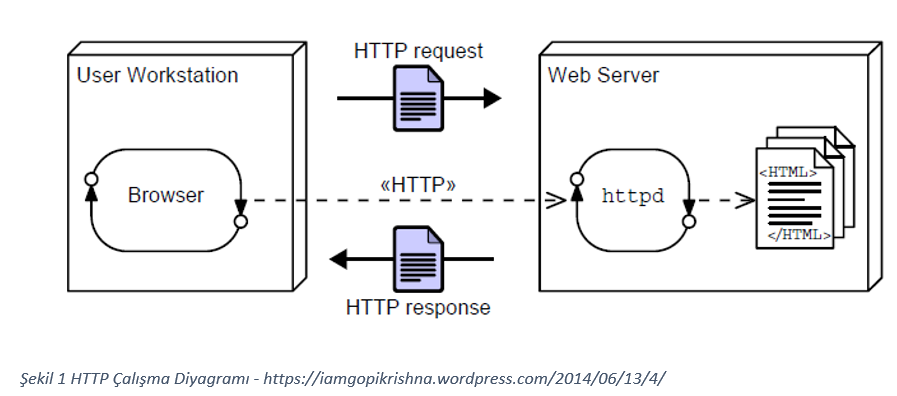

İlk zamanlarda HTTP üzerinden gerçekleştirilen veri transferleri(örneğin bir web sayfasında gezinmek) büyük sistemlerde fazlasıyla gereksiz traffik meydana getirmekteydi. Çünkü sistemde meydana gelen trafiğin yarısından fazlasının aslında hiç değişmeyen verilerin tekrar sunucudan talep edilmesi sonucu oluştuğu bilinmekteydi. Örneğin bir web sayfasınının sadece ufak bir yerindeki değişimi görmek için bütün sayfanın yenilenmesi gerekiyordu. Yani sayfanın tümü tekrar sunucudan talep edilmekteydi. Yada mail kutunuza yeni bir mail gelip gelmediğini tüm sayfayı yenileyerek öğrenmeniz gerekir. Bu tür bir durumda yeni bir mail olduğuna dair gelen bildirimin oluşturacağı trafiğinin yüz, belkide binlerce katı zaten hiç değişmeyen kısımlara ait aynı verilerin oluşturduğu trafik olmaktaydı. Değişen kısımdaki veri kilobaytlardan bile az bir trafik oluşturmasına rağmen bu değişikliği görmek için tüm web sayfasının yenilenmesi sonucunda megabaytlara varan bir trafiğe neden olmaktaydı. Öte yandan bu durum son kullanıcılar açısından da ciddi sorundu. Borsa değerlerindeki anlık değişimi veya sosyal medyada sizi ilgilendiren bir bildirim var mı? diye kontrol etmek için hiç kimse  sayfayı yenileme taraftarı değildir. Bu durum hem kullanıcı açısından hemde sunucu açısından ciddi problemleri doğurmaktadır. Tabi ki bu alanda birşeyleri değiştirme gücüne sahip olan bilişim firmaların dikkatlerini başından beri çekmiş olmalı ki bunu çözmek için yeni yöntemler geliştirdiler. İşte bu tür real-time uygulamalara duyulan ihtiyacın artmasından dolayı bunu karşılamak için bazı yöntemler geliştirildi. Bu problemi çözmek için bulunan çözüm yöntemleri geçmişten günümüze doğru olacak şekilde aşağıda açıklanmıştır.
 
İlk başlarda bu problemlere çözüm bulmak için “Polling” adı verilen yöntem kullanılmaya başlandı. Bu yöntemin temelde yaptığı işlev ise, sunucuya belli aralıklarla istemci tarafından request gönderilmekteydi. Örneğin her 30 saniyede bir sunucuya request göndererek bir verinin değişip değişmediğini 30 saniyelik gecikmeler ile öğrenebilmek mümkün hale geldi. Ancak bu yapının kendisine ait bazı sıkıntıları var. Gecikme süresini düşürebilmek için belli periyotlarla yapılacak request sayısını artırmak, aynı zamanda trafiği artırmak anlamına gelmekteydi. Örneğin her 3 saniyede bir request gönderilerek, sayfada değişmeyen bir şey olmasına rağmen yinede gereksiz traffik oluşturmaktaydı. Sonuçta bu yapının temelinde olan da yine request ve response sistemiydi. Aşağıdaki bu sistemin işleyişine ait grafik yer almaktadır.

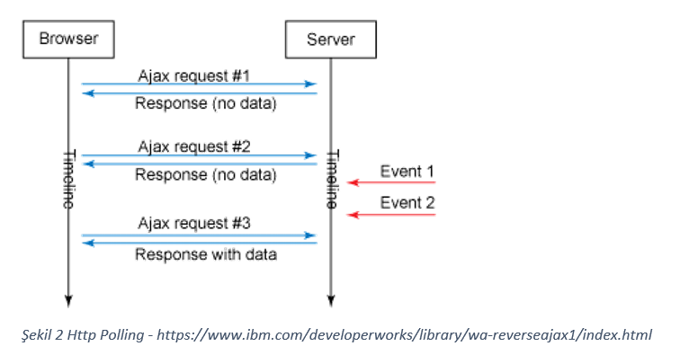

Polling yönteminde veri belki saatlerce boyunca hiç değişmemesine rağmen gereksiz yere binlerce request gönderilmekteydi. Büyük sistemler için hala bu ciddi bir sorun oluşturmaktaydı. Bu sistemi biraz daha iyileştirmek için “Long Polling” yapısı ortaya çıktı. Bu sistem ise istemciden sunucuya bir verinin değişip değişmediğine ait bir request yapıldığında, sunucu bu requesti aldıktan sonra eğer veri değişmemiş ise, istemciye “veri değişmedi” şeklinde hemen dönüt yapmak yerine kendi içerisinde bu isteği sonsuz bir döngüye alarak ilgili veri değiştiği anda istemciye cevap dönmekteydi. “Polling” yöntemine nazaran biraz daha iyi ancak büyük sistemler sunucu tarafındaki yük fazlasıyla artacaktı. Neticede bu yöntem bile hala request ve response mimarisine dayandırılmaktaydı. Hala bağlantı half-duplex.

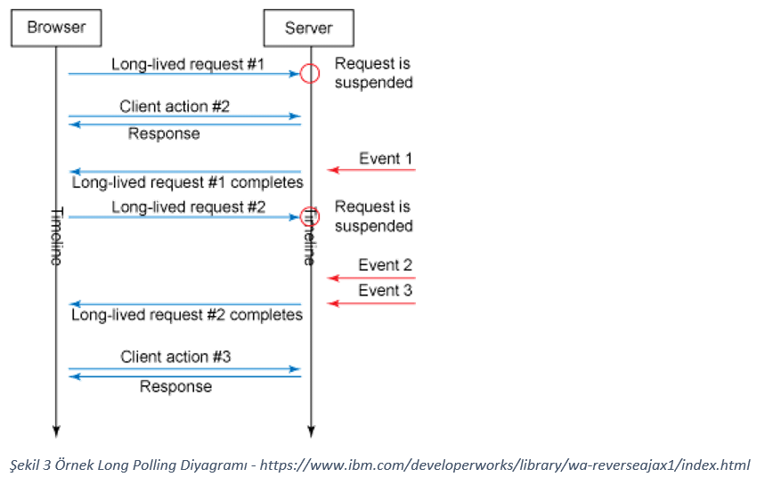

Hala büyük sistemlerin çoğu “Long Polling” kullanmaktadır. Bunun nedenleri arasında bu sistemlerin geliştirildiği zamanlarda hatta bu zamanlara kadar websocketlerin bu kadar yaygın olmamasıdır. Öte yandan bu sistemlerin sunucu tarafındaki optimizasyon çalışmalarının çok iyi olduğu ve güçlü donanımlar yönünden bir sorunları olmadığı için neden long polling kullandıklarını açıklamaktadır. Ayrıca websocketlerin yeni olmasının bu sebepten henüz tam olgunlaşmadığına dair şüphelerin olmasıda bu durumu etkiliyor olabilir.

## Websocket
Yukarıda real-time uygulamalar geliştirmek için sunulan yöntemlerin kendi içerisinde sıkıntıları olduğundan dolayı daha iyisi için sürekli çalışılmaktadır. İhtiyaçlar değiştikçe veya büyüdükçe bu süreç sürekli böyle tekerrür edecektir. Websocketler günümüzde ise artık birçok yerde kullanılmaya başlanmıştır. Çünkü bir çok alandaki ihtiyaçlarımıza ideal çözüm sunabilmektedir. Anlık mesajlaşmalar,  borsa özetle anlık veri transferleriihtiyacı olan heryerde kullanılabilir. Websocketleri diğerlerinden ayıran ciddi özellikleri bulunmaktadır. 

Öncellikle serverda bir değişiklik meydana geldiğinde serveri bunu client’a bildiremez ancak client’dan servar’a bir request gönderilmesi sonucunda bu değişiklikten haberdar olunabilmektedir. Polling ve Long Polling yöntemleride bu temeli esas alarak çalıştığından dolayı websocketler ile aralarındaki en temel farkı da bu oluşturmaktadır. Websocketler sunucu ve istemci arasında olan half-duplex iletişimi full-duplex bir şekle dönüştürmektedir. Böylece yerine göre istemciden suncuya veri akışı olabileceği gibi sunucudan da istemciye veri iletişimi olabilmeliydi. Yani sunucu kendisine bir request gönderilmemesine rağmen istemciye veri gönderebilmektedir. Çünkü websocketlerde half-duplex yapısı esas alınmamıştır. Böyle bir yapı şuana kadar olan tüm birçok soruna en pratik çözümü sunmuştur. Ne istemci tarafından gereksiz ve sürekli bir şekilde sunucuya request gönderilmekte ne de sunucunun iş yükünü artırran yöntemler kullanılmakta. Veri değiştiğinde ilgili metodlar tetiklenmekte ve bu bilgi client’a gönderilmektedir. Bunu sağlarken baytlarla ifade edilecek bir trafik oluşmakta ve bu durumda en büyük sistemlerde bile çok az bir traffikle real-time şekilde veri transferi sağlanabilmektedir. Aşağıdaki diyagramda websocketlerin çalışma yapısı gösterilmiştir.

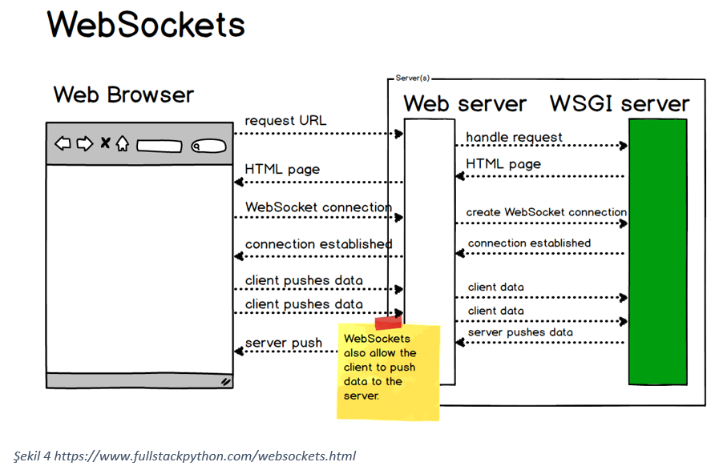

Aşağıda yapılan bir benchmark[1] ile eşit sayıda mesajlar hem websocket hemde rest üzerinden gönderilerek performans testi yapılmıştır. Grafikten anlaşılacağı üzere açık ara farkla websocketlerin çok başarılı olduğu görülmektedir. 

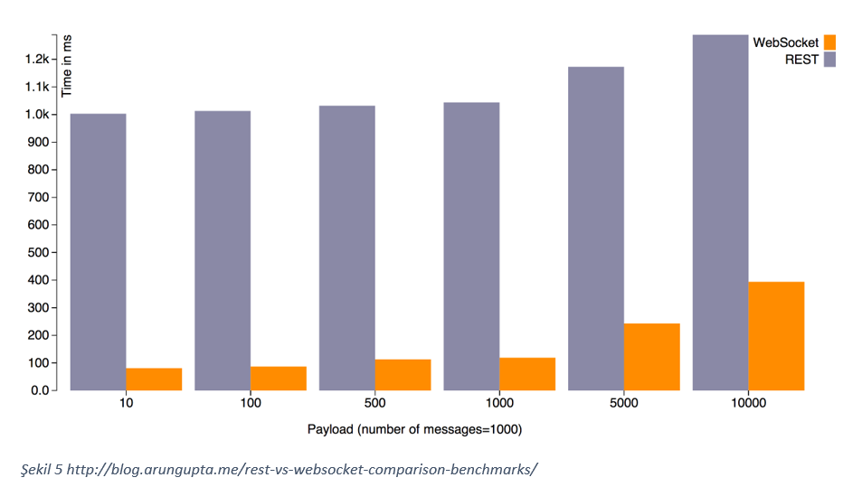

## Senkron ve Asenkron Programlama
Senkron programlama modelinde yazılımı oluşturan kodlar sırasıyla çalışmaktadır. Bir süreç bitmeden diğer süreç başlayamamaktadır. Özellikle disk, network girdi/çıktı işlemleri yapan senkron geliştirilmiş olan yazılımlar, yaptığı işleri çok geç bitirmektedir. Bunun nedeni ise network işlemleri veya diskten veri okuma, yazma gibi işlemler bitmeden sonraki kod bloklarını çalıştıramamasıdır. Haliyle bu bekleme bir noktadan sonra ciddi sorunlara sebep vermektedir. Örneğin senkron çalışan bir web sunucusu kendisine gelen bir isteği yanıtlayacağı zaman o anki o işlemler bloklanır, yani başka işlem yapılmasına izin vermez. Aslında istemciden sunucuya bir request göndermek çok hızlı gerçekleşmektedir. Ancak burdaki ana sorun request gönderileceği zaman cevap için beklenmesidir. Ve bu tür işlem yapan yazılımların geç yanıt dönmesinin temelinde de bu gibi nedenler yatmadır. 

Büyük sistemlerde senkron şekilde geliştirilen yazılımlar varsa yoğun işlemlerin olduğu zamanlarda sistemin servis dışı kalma olasılığı yüksektir. Sisteme göre değişssede, bir kaç yüz kullanıcının aynı zaman aralıklarında sunucuya gönderecekleri requestler olacaktır. Sunucu o an için hangi request’e response dönüyor ise o işlem için birkaç saliseliğine de olsa bloklanır. İsteğe,yanıt döndükten sonra sonraki isteği alır. Bu böyle devam eder. Kullanıcı sayısının az olduğu sistemlerde bu bloklanma sorun teşkil etmeyecektir. Ancak büyük sistemlerde aynı anda yapılan binlerce request için saliseler saniyelere belki dakikalara ulaşacaktır ve sistemi çalışamaz hale getirmektedir.

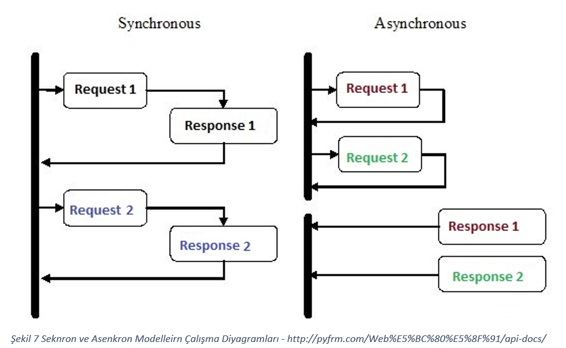

Bu sorunu çözmek için ise asenkron programlama modeli geliştirildi. Bu model ile özellikle çok zaman alan diske veri yazma okuma gibi veya network işlemlerinde paket gönderme alma gibi durumlarda bu model sayesinde işlemler bloklanmadan hızlı bir şekilde gerçekleşebilmektedir.
Hatta tek bir thread ile asenkron çalışan kütüphaneler yardımıyla süreçler çok kısa sürede çok işlem yapabilmektedir. Bir asenkron uygulama uzak bir sunucuya request göndereceği zaman sunucudan cevap dönmesini beklemek yerine başka işlemler yapar. Uzak sunucudan yanıt geldiği vakit o zaman tekrar oraya dönerek kaldığı yerden devam eder. Asenkron modelde, eğer diske veri yazılıp okunacak ise veya network işlemlerinde paket gönderilip alınacağı durumlarda ilgili süreç i/o komutunu verdikten sonra cevap gelinceye kadar başka işlemleri yapmaya çalışır yani önceki kod bloğundaki işlemler bitmeden sonraki kod bloğuna geçebilmektedir. İlgili yerden(disk, network)’a ait response döneceği zaman callback metodu ile işlemin bittiği haber edilir ve bunun için bir interrupt gönderilir. Bu interrupt’dan sonra program dönen response işlemeye başlar. Böylelikle okuma,yazma işlemlerindeki bekleme durumu başka işler yapılarak değerlendirilmiş olur. Çünkü bu tür işlemlerde CPU’ya gennellikle ihtiyaç duyulmaz. DMA üzerinden işlemler yürütülürken response gelinceye kadar aynı thread başka işlemleri yapabilmektedir. 

Geliştirilen projede(remasevum) real-time olacağı için stabilite ve performans önemli iki ana bileşeni oluşturmaktaydı. Bu şartlar sağlandığı tardirde en zayıf donanımlarda bile başarılı sonuçlar verebilecekti.  Bu sebeple projede asenkron bir kütüphane kullanılarak asenkron bir server oluşturuldu. Bu sayede http trafiğinin yoğun olacağı durumlarda bile bloklama meydana gelmeyecekti. Yani sucunucudan istemciye giden requestler geliş sırası yerine bitiş sırasına göre dönüt yapacaktır.

## Makine Öğrenmesi

Makine öğrenmesinin real-time çalışan sistem üzerinde uygulamak için eğitilmiş bir sisteme ihtiyaç vardır. Çünkü real-time olarak gelen veriler hakkında anlık kararlar verebilmesi gereklidir. 
Projede, metin işleme ve doğal dil işleme alanında sıklıkla kullanılan term frequency–inverse document frequency (TF-IDF) kullanıldı. Makine öğrenmesi modeli özellikle URL(Uniform Resource Locator) üzerinden karar vereceğinden dolayı datasette bulunan tüm URL adresleri TF-IDF kullanılarak numerik hale getirildi. Daha sonra oluşan matris ile sistem eğitilerek bir matematiksel model geliştirildi. Eğitim verileri sonucunda sistem yüzde 97.19 oranında başarım sağlandı.
Sistem eğitilirken bu bağlantıda bulunan dataset kullanıldı

Bu aşamadan sonra ilgili model serilize edilerek binary olarak kaydedildi. Bu sayede proje bir çok defa çalıştırıldığında her seferinde tekrar sistemin tekrar eğitilmesi ve bekleme süresi sorunları çözülmüş oldu. Çünkü eğitilen model kaydedilerek sonraki çalıştırmalarda kaydedilen model doğrudan import edilmektedir.
Ayrıca makine öğrenmesinden dönen sonuçlar sunucu taraftaki terminal ekranında da real time olarak gösterildi. Aşağıdaki resimde projenin sunucu tarafındaki makine öğrenmesine ait tahminlere dayalı yanıtlar görülmektedir.

Projeye ait akış şeması aşağıdaki şekildedir.

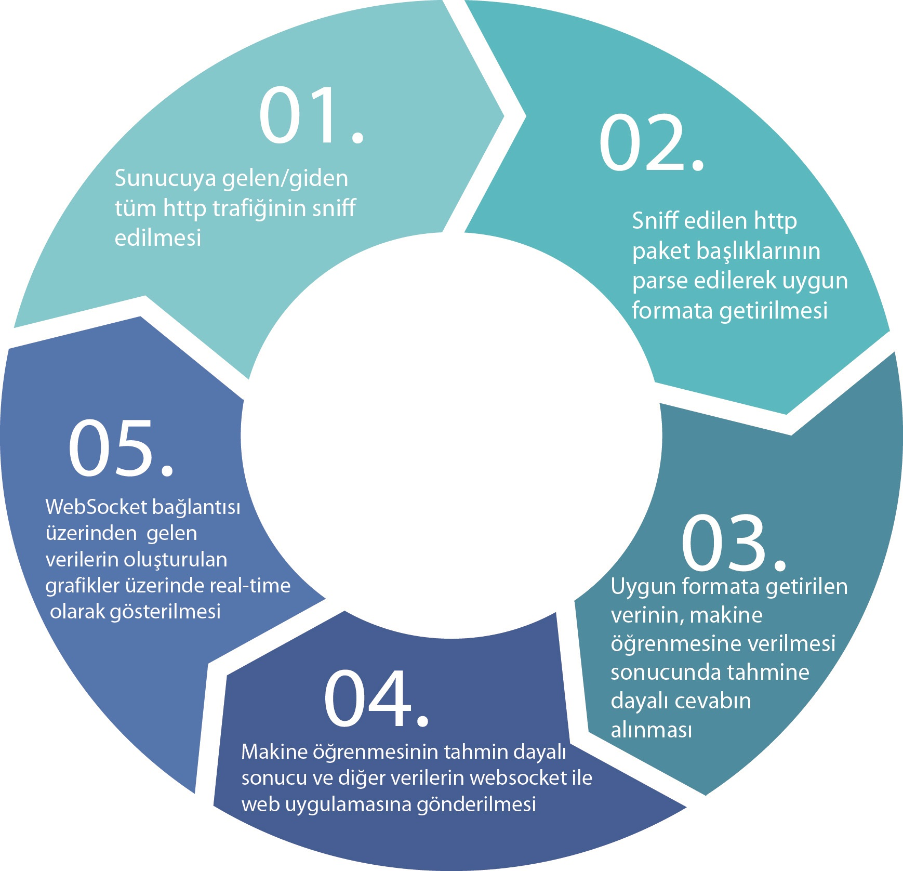

## Web Uygulamasına Ait Ekran Görüntüleri

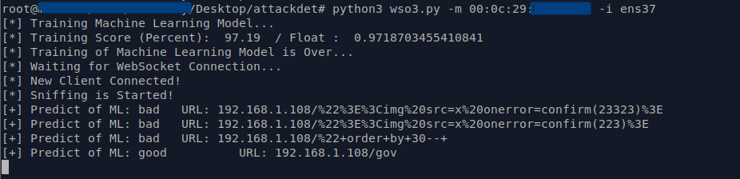  

  

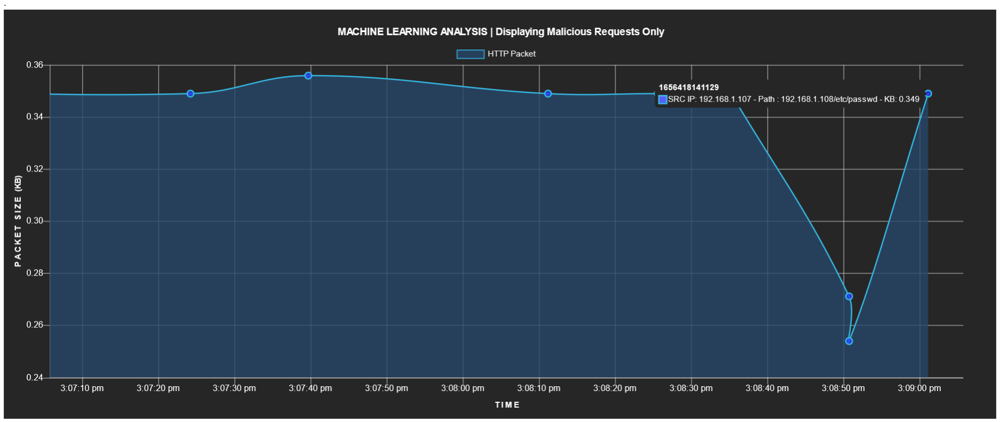  

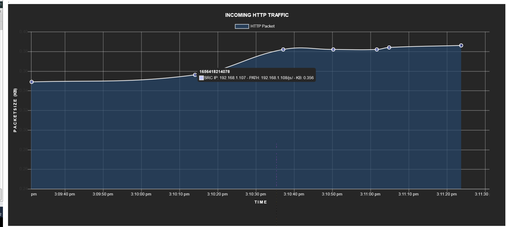  

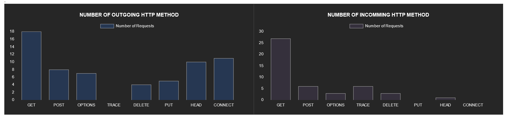  

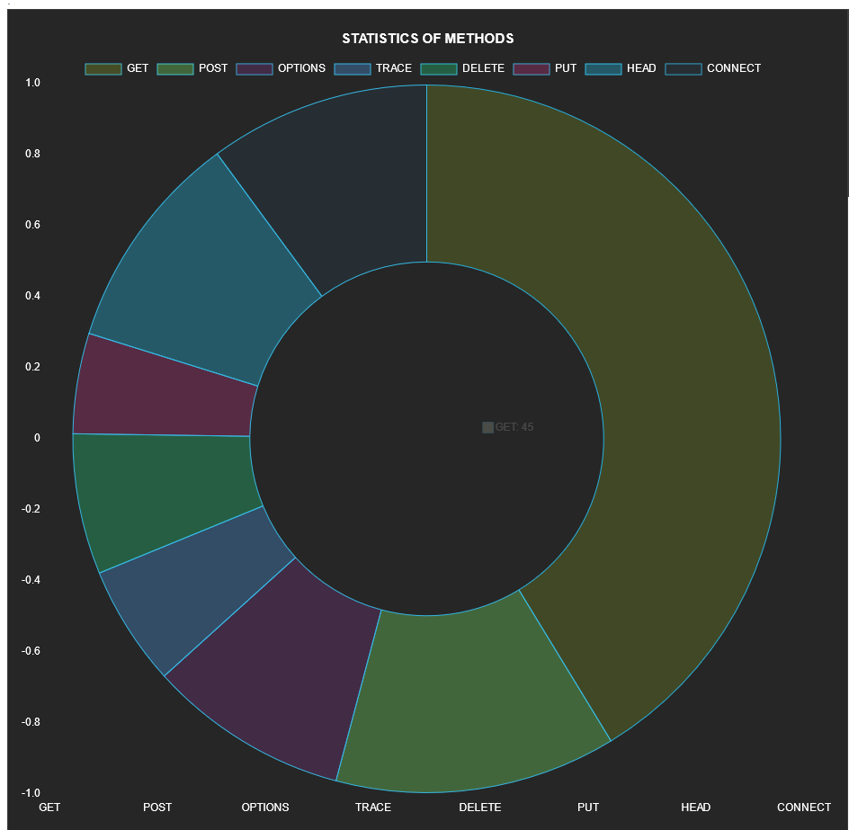  

## Projenin Çalıştırılması
1. `pip3 install -r requirements.txt` ile ilgili kütüphanelerin kurulması
2. chart.js 517. satırda bulunan websocket bağlantısı için ip bilgisinin kendize göre değiştirilmesi
3. `python3 wso3.py -m <mac-adresiniz> -i <network-interface>` ile projenin başlatılması. Tüm işlemler başarılı olur ise web socket bağlantısını bekleyecek.
4. web socket bağlantısını başlatmak için `index.html` dosyasını herhangi bir tarayıcıda başlatılması.

## Referanslar
[Dataset](https://github.com/Jcharis/Machine-Learning-In-Julia-JCharisTech)

